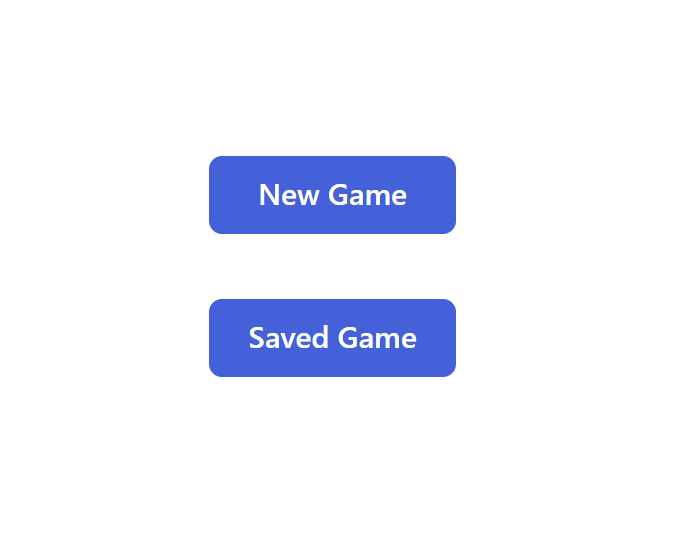
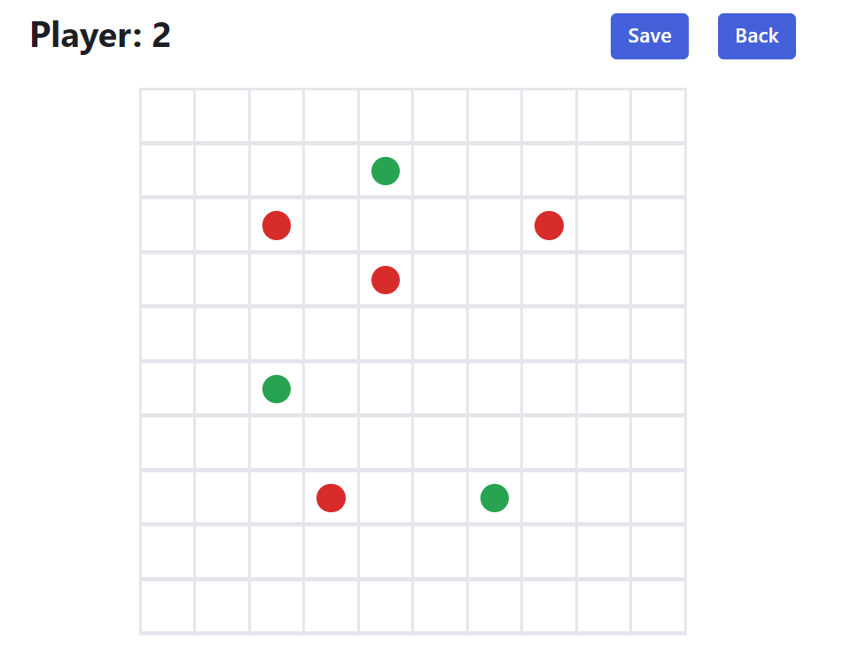
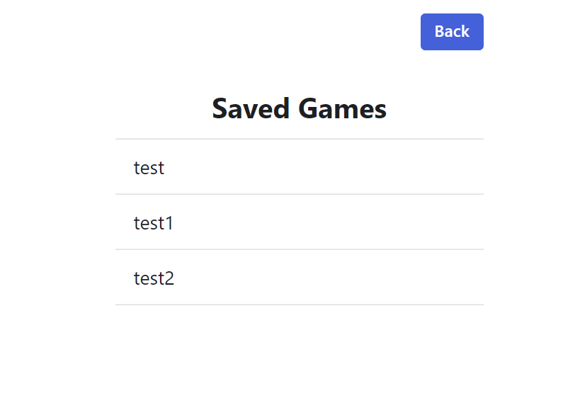

# Board-Game
Build a simple board game on 10x10 grid where 2 players can play in turn to put 5 sequent stones of the same color.





## Tasks
Build a simple board game on 10x10 grid where 2 players can play in turn to put 5 sequent stones of the same color.

- Render playground grid
- Users should be able to put stones on the empty boxes in turn
- Check winning conditions
- There are 2 buttons on UI to work.
- "New Game" - Game should be initialized
- "Save Game" - Current game status should be saved with game name
- There should be a list view showing game history and user should be able to select one of them to see the state.

## Environment
- Windows 11
- Node v16.20.2
- Npm 8.19.4

## Tech stacks
- Vite + React + Typescript
- Express
- Radix UI
- Tailwind CSS

## Steps to run program
1. Install node modules
   ```shell
   npm install
   ```

2. Run project
   ```shell
   npm run dev
   ```
This will host the project on http://localhost:3000.